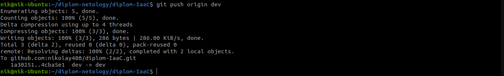
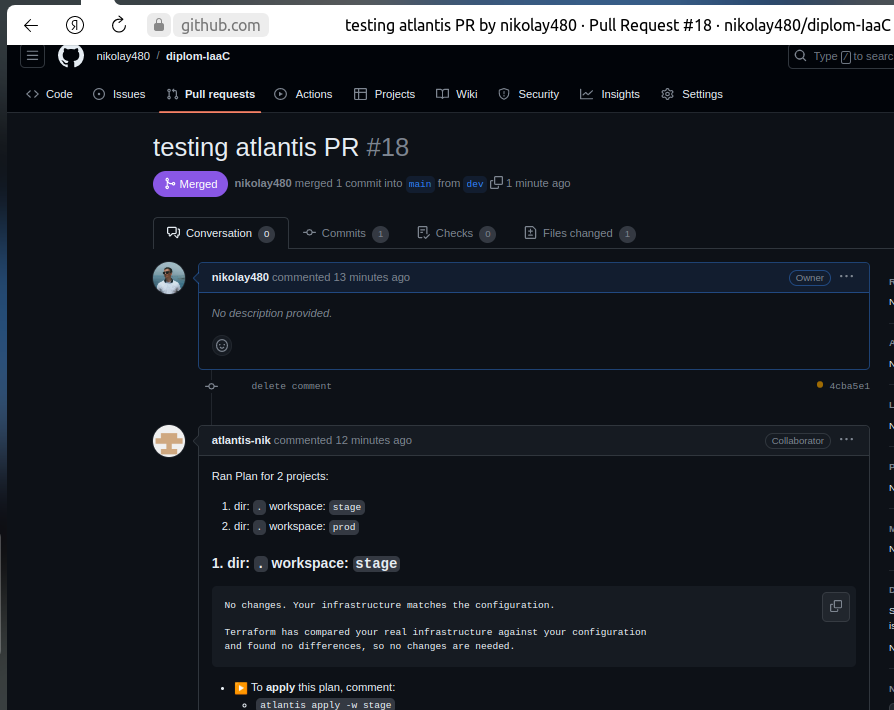
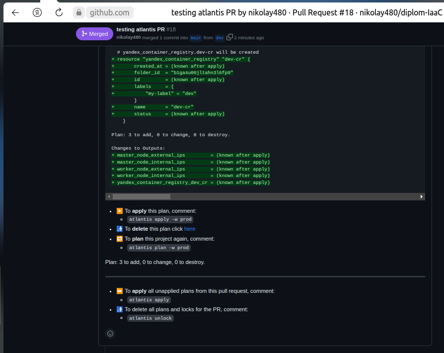
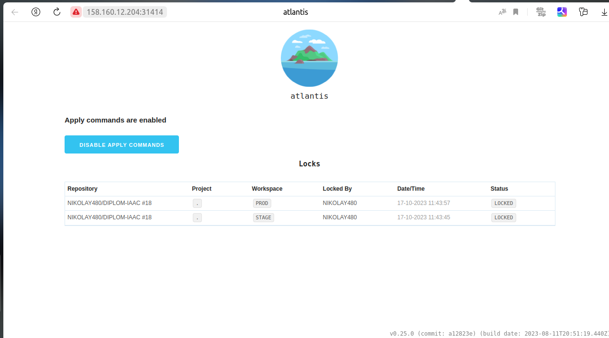

## Установка и настройка Atlantis

https://www.runatlantis.io/docs/deployment.html#kubernetes-helm-chart

Добавим  репозиторий:

`helm repo add runatlantis https://runatlantis.github.io/helm-charts`

Опишем в файле [values.yaml](./helm/values.yaml) конфигурацию `atlantis`. 

Также перед запуском  создадим  `secrets`: 
- `atlantis-vcs` - для аутентификации на `github` и использования `webhooks`
- `aws-creds` -  для доступа к S3 в YandexCloud
- `yc-key-secret` - ключ сервисного  `sa` для авторизации в YC
- `ssh-secret` - публиный ключ для проброса на виртуальную машину при создании, для возможности последующей аутентификации.

Еще будет необходим `configmap` для файла `.terraformrc`, иначе будет недоступно зеркало Yandex Cloud.

**Примечание**. Если отсутствует StorageClass, необходимо создать его указать его имя в `values`, либо создать PV. Для удобства я создал PV на файловой системе.

**Перейдем  к настройке GitHub.**

Создадим аккаунт пользователя `atlantis-nik`, добавим его в репозиторий , где будет храниться наша конфигурация. 

Настроим `webhook`, определим `secret` , отметим его для событий `Pull request reviews`,`Pushes`, `Issue comments`, `Pull requests`. 

В репозитории с конфигурацией  также разметим [atlanti.yaml](https://github.com/nikolay480/diplom-IaaC/blob/main/atlantis.yaml)

После всех подготовительных мероприятий можно запустить установку:

`helm install atlantis runatlantis/atlantis -f values.yaml -n atlantis`

По завершении установки, можно внести изменения в ветку `dev` репозитория с конфигурацией

Создать PullRequest:

Перейдя по ссылке http://158.160.12.204:31414/ увидим lock state teraaform.
