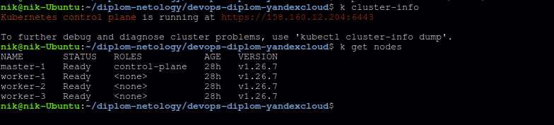
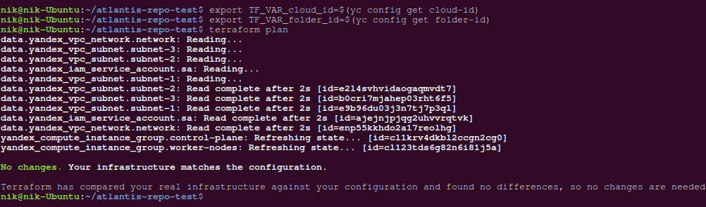
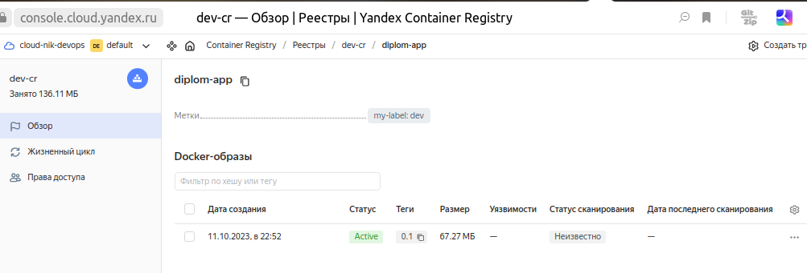
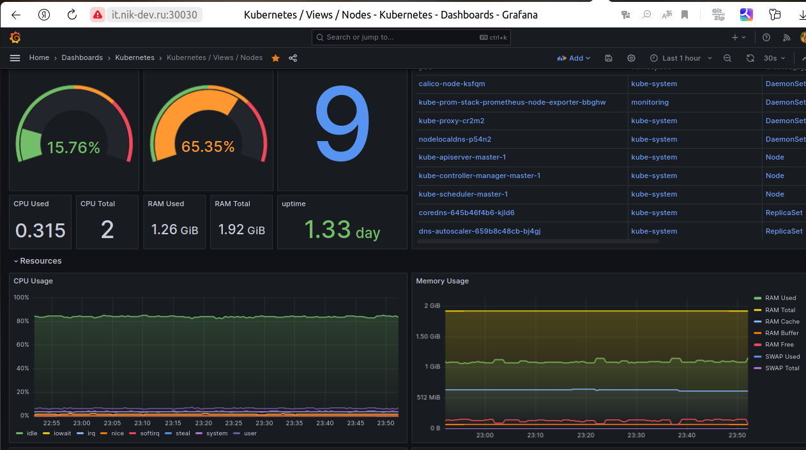
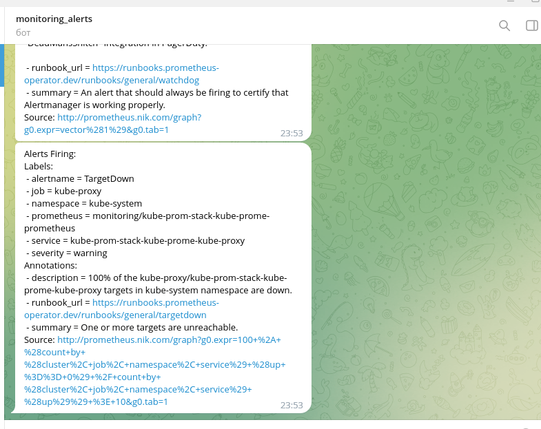
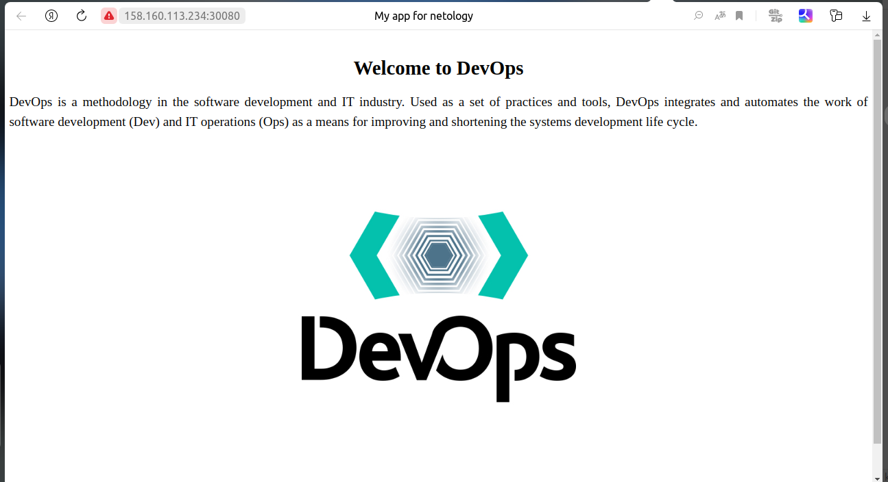
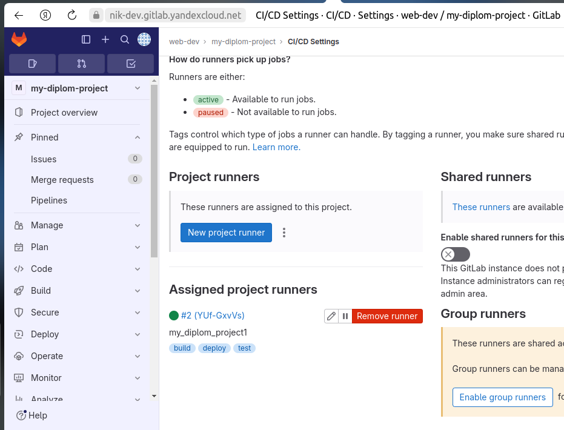
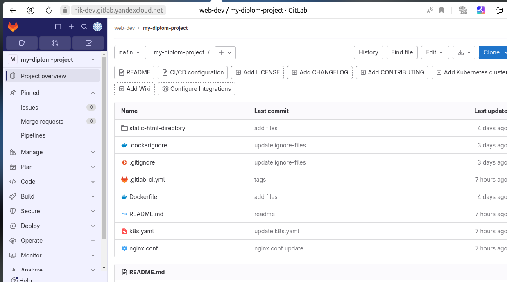
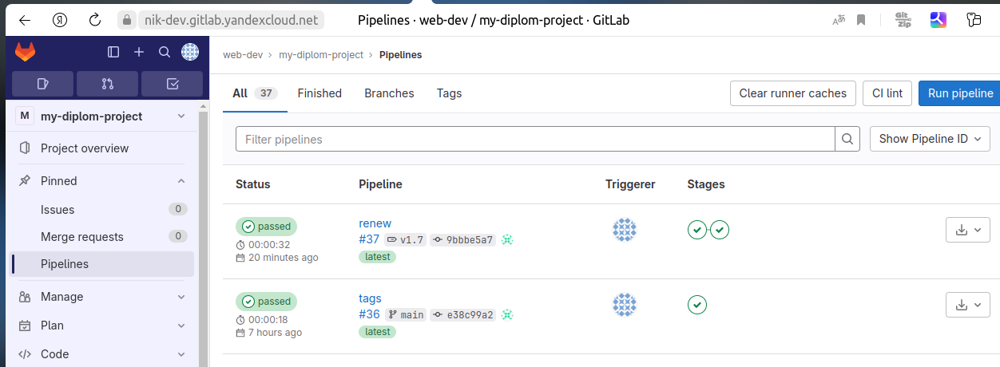
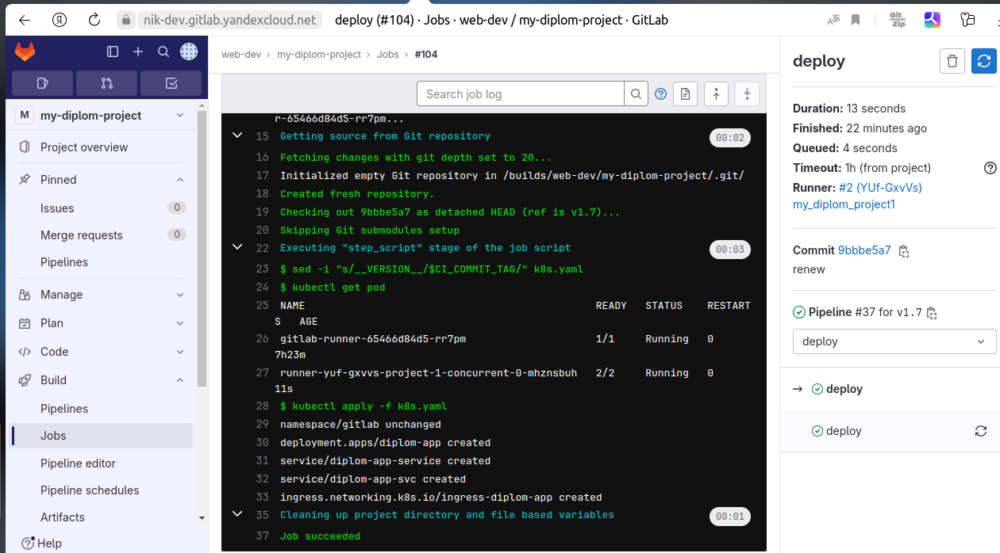

# Дипломный практикум в Yandex.Cloudloud

## Подготовка облачной инфраструктуры на базе облачного провайдера Яндекс.Облако.

- Создадим сервисный аккаунт `sa`, который будет в дальнейшем использоваться Terraform для работы с инфраструктурой с необходимыми и достаточными правами.
- Подготовим бэкенд S3
- Создадим VPC сеть `k8s-net` с подсетями `public-subnet-a` ,`public-subnet-b`, `public-subnet-c` в разных зонах доступности.

Кроме того, в Terraform создадим 2 workspace: `stage` и `prod`. Значения переменных будут зависеть от пространства имен, которые определены в разделе `local`. В целях экономии ресурсов будет использоваться workspace `stage`, для которого значения ресурсов заданы ниже, чем в `prod`.

Результат:
-  [Terraform сконфигурирован](https://github.com/nikolay480/diplom-IaaC/tree/main/01-preparation-yc)
-  С помощью команды `terraform apply` развернута предварительная инфраструктура.
___

## Создание Kubernetes кластера

На этом этапе создадим Kubernetes кластер на базе предварительно созданной инфраструктуры.

В своем проекте я буду разворачивать Kubernetes самостоятельно, не используя сервис [Yandex Managed Service for Kubernetes](https://cloud.yandex.ru/services/managed-kubernetes). 

Поэтому сначала при помощи Terraform подготовим [инфраструктуру](https://github.com/nikolay480/diplom-IaaC/tree/main) в Compute Cloud для создания Kubernetes-кластера. Через описание  [yandex_compute_instance_group](https://github.com/nikolay480/diplom-IaaC/blob/main/instance_group.tf) создадим 1 узел для `control-plane` и 3 узла для `worker-nodes`.

Далее воспользуемся `Kubespray`, предварительно настроив [Ansible конфигурацию](01-kubespray/inventory/k8s-cluster). В качестве инвентори используем файл [hosts.yaml](./01-kubespray/inventory/k8s-cluster/hosts.yaml).

По завершении установки, скопировав содержимое файла [admin.conf](./01-kubespray/inventory/k8s-cluster/artifacts/admin.conf) в файл  `~/.kube/config`, подключимся к кластеру:

**Примечание**. За включение возможности копирования на host Ansible файла `admin.conf` в group_vars отвечает параметр `kubeconfig_localhost: true`.
___
## Создание тестового приложения

Для перехода к следующему этапу подготовим тестовое приложение, эмулирующее основное приложение разрабатываемое компанией.

Создадим репозиторий [diplom-app](https://github.com/nikolay480/diplom-app) c nginx-приложением и конфигурацией, а также `Dockerfile` для сборки image.

Для хранения образов в [конфигурации terraform](https://github.com/nikolay480/diplom-IaaC/tree/main) добавим файл [yc_registry.tf](https://github.com/nikolay480/diplom-IaaC/blob/main/yc_registry.tf), с помощью которого будет создан `Yandex Container Registry`.

Соберем `image` нашего приложения и отправим его в наш `registry`.

___
## Подготовка cистемы мониторинга и деплой приложения

### Мониторинг

Для сбора основных метрик  Kubernetes  задеплоим в кластер Prometheus, Alertmanager, NodeExporter и  Grafana. Воспользуемся helm charts [prometheus-community](https://prometheus-community.github.io/helm-chart).

Файл конфигурации и описание установки приведены в разделе [02-monitoring](./02-monitoring/).

По завершении установки будет доступен [http интерфейс](http://158.160.12.204:30030) Grafana c дашбордами основных метрик:

**Примечание.** На скриншоте видно, что вход осуществлен по доменному имени.Здесь ради эксперимента ip адрес привязан к доменному имени, приобретенному  у одного из регистраторов.

Кроме того, настроено оповещение в telegram от Alertmanager:

### Деплоймент приложения

Задеплоим наше приложение в кластере кубернетес: 

`k apply -f ` [k8s.yaml](./03-deployment/k8s.yaml)

Проверим его доступность по `http`:

### Настройка отслеживание изменений инфраструктуры

Для отслеживания изменений инфраструктуры задеплоим в кластер и настроим  `Atlantis`.

Файл конфигурации, описание установки, настройки и результаты приведены в разделе [04-atlantis](./04-atlantis/).
___

## Установка и настройка CI/CD

 Настроим ci/cd систему для автоматической сборки docker image и деплоя приложения при изменении кода.

 Будем использовать систему Gitlab CI/CD, развернем с помошью `Managed Service for Gitlab` в Yandex Cloud.

 Gitlab Runner задеплоим в Kubernetes при помощи helm, задав необходимые значения в файле [my-values.yaml](./05-cicd/my-values.yaml).

 Перейдем в Gitlab по ссылке https://nik-dev.gitlab.yandexcloud.net.

 Убедимся, что runner в нашем проекте доступен:
 

 Создадим репозиторий с проектом, содержащий следующие [файлы](./05-cicd/repo_gitlab/):
 

 `Pipeline ` описан в файле [.gitlab-ci.yml](./05-cicd/repo_gitlab/.gitlab-ci.yml) следующим образом:
 
 1. При любом коммите в репозиторие с тестовым приложением происходит сборка и отправка в регистр Docker образа.
 2. При создании тега (например, v1.1) происходит сборка и отправка с соответствующим label в Container Registry, а также деплой соответствующего Docker образа в кластер Kubernetes.

**Убедимся, что наше приложение доступно по ссылке: [diplom-app](http://158.160.113.234:30080/)**
---
# Итоги
 Таким образом в данном проекте:
 - Подготовлена облачная инфраструктура на базе облачного провайдера YandexCloud c помощью Terraform.
  
- Cконфигурирован и запущен Kubernetes кластер c помощью Kubespay.

- Установлена и настроена система мониторинга (Prometheus,NodeExporter, Grafana, Alertmanager).
  
- Настроена и автоматизирована сборка тестового приложения с использованием Docker-контейнеров.
  
- Настроена СI/CD система (Gitlab CI/CD) для автоматической сборки и развертывания приложения.
